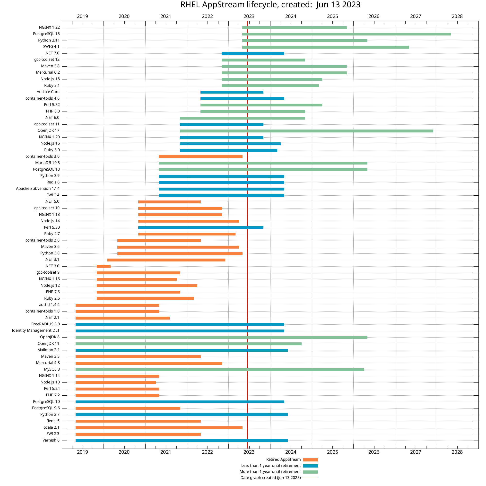
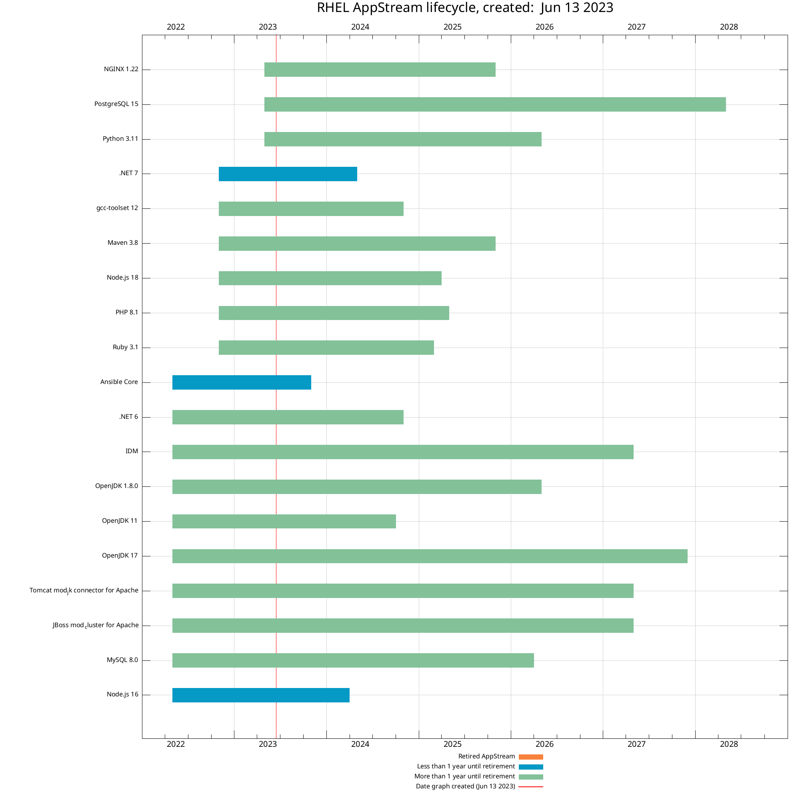

# Gnuplot script to generate graph of RHEL Application Stream lifecycle


# Example graphs

**RHEL 8 Application Stream (generated June 13, 2023)**



**RHEL 9 Application Stream (generated June 13, 2023)**




# Creating input files
The two input files (`rhel8_appstream.txt` and `rhel9_appstream.txt`) were copy/pasted from the tables on the [Red Hat Enterprise Linux Application Streams Life Cycle](https://access.redhat.com/support/policy/updates/rhel-app-streams-life-cycle) page with the following modifications:
* First column was updated to have the application name be in quotes
* The order of the list was reversed using the `tac` command

# Creating graphs
Specify the inputfile and outputfile on the gnuplot command line, for example: 

```
gnuplot -e 'inputfile="rhel8_appstream.txt"' -e 'outputfile="rhel8_appstream.png"' appstream.gnu
gnuplot -e 'inputfile="rhel9_appstream.txt"' -e 'outputfile="rhel9_appstream.png"' appstream.gnu
```
